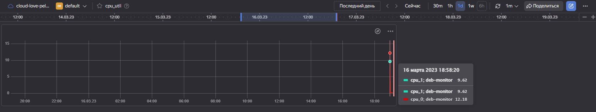

# Домашнее задание к занятию "`Название занятия`" - `Фамилия и имя студента`

### Задание 1
Создайте виртуальную машину в Yandex Cloud Compute Cloud и с помощью Yandex Monitoring создайте дашборд, на котором будет видно загрузку процессора.

